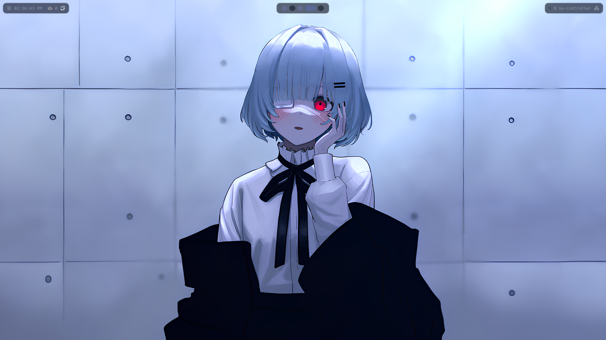

⚡ Dotfiles Hyprland — Minimal!

O foco principal dessas configurações é:

minimalismo
desempenho
fluidez no uso diário
organização visual simples

As configurações foram ajustadas manualmente ao longo do tempo para atender às necessidades específicas do meu sistema.

⚠️ Aviso Importante

Estas configurações foram desenvolvidas sob medida para o meu hardware, que utiliza plataforma totalmente AMD.

Devido a isso, usuários com hardware diferente podem encontrar comportamentos inesperados.

Em especial:

sistemas com GPU NVIDIA
sistemas com gráficos Intel
